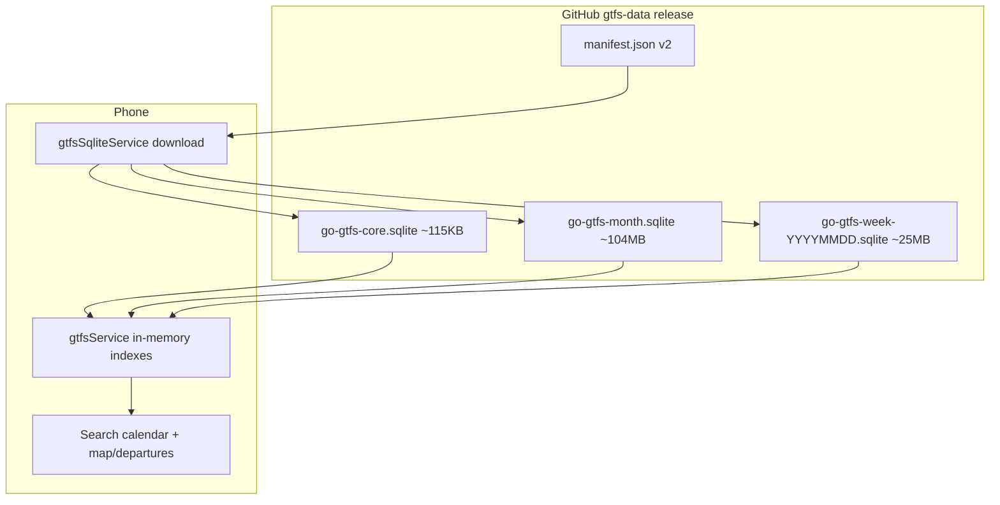

# Transit Scanner handoff — GTFS split download & sliced memory load

Use this to bring VS Code Copilot up to speed before an **iOS EAS build and ship**. Latest code is on `master` at commit **`49975e6`** (2026-05-25). GitHub **gtfs-data** release was refreshed the same day with v2 artifacts.

---

## Problem we solved

The app previously downloaded one **`go-gtfs-v1.sqlite` (~390–409 MB)** and loaded **all `stop_times` (~3M rows)** into JS memory at startup → **OOM / crashes** and long stalls.

**Goals:**

1. Smaller downloads (core + month, not full monolith by default).
2. Load only the schedule slices needed in RAM (startup 7 days; search ±3 by date + train/bus).
3. Calendar only allows dates the device actually has schedules for.
4. Background updates every **7 days**, with week extensions without re-downloading the full month.

---

## Architecture (high level)



### What each SQLite file contains

| File | Tables | Purpose |
|------|--------|---------|
| **go-gtfs-core.sqlite** | stops, routes, pathways, calendar, calendar_dates | Static network + calendar rules; always downloaded with bundle |
| **go-gtfs-month.sqlite** | routes, trips, stop_times | **30 days** from CI “today” (Toronto): `today .. today+29` |
| **go-gtfs-week-YYYYMMDD.sqlite** | routes, trips, stop_times | **7 days** after month end (extends coverage without new month version) |

**Legacy:** `go-gtfs-v1.sqlite` still on the release for **v1 manifest fallback**; new app code prefers v2 when `manifest.json` has `core` + `month`.

### Manifest v2 shape

```json
{
  "version": "<run-id>",
  "generatedAt": "...",
  "buildDate": "YYYYMMDD",
  "core": { "fileName", "url", "sizeBytes", "checksumSha256" },
  "month": { "fileName", "url", "sizeBytes", "checksumSha256", "startDate", "endDate" },
  "weeks": [{ "id", "fileName", "url", "sizeBytes", "checksumSha256", "startDate", "endDate" }]
}
```

**Live release URLs used by Transit Scanner (default in app):**

- Manifest: `https://github.com/harpreetmailsgh/TrackTransit/releases/download/gtfs-data/manifest.json`
- Note: the current published GTFS release artifacts are hosted in the existing GitHub repo path `harpreetmailsgh/TrackTransit`.
- Override via `EXPO_PUBLIC_GTFS_SQLITE_MANIFEST_URL` / `EXPO_PUBLIC_GTFS_SQLITE_DB_URL` if needed.

---

## Download policy (why it works this way)

Implemented in **`services/gtfsSqliteService.js`**.

| Situation | Behavior |
|-----------|----------|
| **First install** or missing files | Download **core** + **month** |
| **Manifest `version` changed** | Re-download core + month; **reset** installed week tracking |
| **Same version**, 7+ days since `lastCheckAt` | Download only **missing week** files from `manifest.weeks[]`; update `effectiveCoverageEnd` |
| **Manifest v1 only** (`dbUrl`, no `core`/`month`) | Fall back to single **`go-gtfs-v1.sqlite`** download (old behavior) |

**Meta file on device:** `go-gtfs-bundle-meta.json` (document directory) — version, month span, `installedWeeks[]`, `effectiveCoverageEnd`, `lastCheckAt`.

**Important:** GitHub is **static files**, not a query API. Dates outside downloaded files cannot be loaded until CI publishes a month/week file and the app downloads it.

---

## Memory / load policy (why no OOM)

Implemented in **`services/gtfsService.js`** + loaders in **`gtfsSqliteService.js`**.

| When | What loads into RAM |
|------|---------------------|
| **Startup** | Core tables + **today..today+6**, **train + bus**, via batched SQL (no `getAllAsync` on full `stop_times`) |
| **Search / saved** | `ensureSchedulesForDate(ymd, { modes })` loads **±3 days** around date, only **train** and/or **bus** per UI toggles |
| **Tracking** | `loadedScheduleKeys` Set: `"YYYYMMDD:train"` / `"YYYYMMDD:bus"` — skip re-read if already loaded |

**±3 clamp:** Window is clipped to `[today, effectiveCoverageEnd]` (and month `startDate`). Example: coverage ends Jan 30 → picking Jan 30 only loads Jan 27–30, not Feb 1–3.

**Exports Copilot should know:**

- `ensureSchedulesForDate(ymd, { modes, onProgress })`
- `getPlanningDateBounds()` → `{ minYmd: today, maxYmd: effectiveCoverageEnd }`
- `clearLoadedScheduleKeys()` — call after GTFS update reload
- `isSchedulesReady()` — startup slice done
- `loadGtfs({ onProgress, onSchedulesReady })`

**Indexes:** `appendStopTimeRowToIndexes` + `finalizeStopTimeTripIndexes`; trips merged into `tripsById` incrementally.

---

## UI behavior

### Search (`app/(tabs)/search.jsx`)

- **Month calendar** (custom Luxon grid), not 14-day list.
- **Selectable:** `today .. effectiveCoverageEnd` only.
- **After coverage:** days shown **disabled** (grey, **no `onPress`**) — user explicitly rejected “tap future day → trigger update”.
- Before showing results: `await ensureSchedulesForDate(selectedDate, { modes: selectedModes })`.

### Home / map (`app/(tabs)/index.jsx`)

- Uses **`schedulesReady`** from `GtfsDataContext` (map can show stops earlier; departures need schedules).

### GtfsDataContext (`contexts/GtfsDataContext.jsx`)

- `onSchedulesReady` from `loadGtfs` sets **`schedulesReady`** when 7-day startup slice finishes (before full `ready` if needed).

### GtfsUpdateContext (`contexts/GtfsUpdateContext.jsx`)

- Hosted SQLite: check remote at most **every 7 days** (not every app foreground).
- On update: `clearLoadedScheduleKeys()` + `reloadGtfsFromCache()`.
- Silent auto-apply for hosted updates (existing behavior).

### Saved (`app/(tabs)/saved.jsx`)

- Preloads schedules for lookahead probe dates via `ensureSchedulesForDate`.

---

## CI / GitHub (already done)

**Workflow:** `.github/workflows/gtfs-sqlite-refresh.yml`
- Weekly + manual `workflow_dispatch`
- Builds with Toronto **today** at run time
- Publishes to release tag **`gtfs-data`**

**Scripts:**

- `scripts/gtfs-active-services.mjs` — shared `activeServiceIdsForDate` / filter logic (GO uses `calendar_dates` heavily).
- `scripts/build-gtfs-sqlite.mjs` — emits core, month, week, manifest v2.
- `scripts/verify-gtfs-sqlite.mjs` — per-artifact validation (`npm run gtfs:verify-sqlite`).

**Last successful publish (2026-05-25):** core, month, week `go-gtfs-week-20260624.sqlite`, manifest v2. Old `go-gtfs-v1.sqlite` still attached.

---

## Key files map (for Copilot navigation)

| Area | Files |
|------|--------|
| Download / SQLite I/O | `services/gtfsSqliteService.js` |
| Schedule logic / indexes / API | `services/gtfsService.js` |
| Startup / ready flags | `contexts/GtfsDataContext.jsx` |
| 7-day update checks | `contexts/GtfsUpdateContext.jsx` |
| Calendar + search load | `app/(tabs)/search.jsx` |
| Saved lookahead | `app/(tabs)/saved.jsx` |
| Map gate | `app/(tabs)/index.jsx` |
| CI build | `scripts/build-gtfs-sqlite.mjs`, `.github/workflows/gtfs-sqlite-refresh.yml` |

---

## iOS build & ship notes (for Copilot in VS Code)

**Stack:** Expo ~54, React Native, `expo-sqlite`, EAS (`eas.json`).

**Suggested EAS flow:**

```bash
# From project root, with EAS CLI logged in
eas build --platform ios --profile production   # or preview for internal
eas submit --platform ios --profile production  # after build succeeds
```

**`eas.json`:** `preview` has `ios.simulator: false` (device/internal). `production` uses channel `production`. App version comes from remote (`appVersionSource: remote`) — bump version in App Store Connect / `app.json` as you usually do.

**No env vars required** for GTFS if defaults are fine (GitHub manifest URL above).

**First launch on new build:**

1. Downloads core (~115 KB) + month (~104 MB) — not 390 MB.
2. Loads 7 days into memory — should avoid previous OOM.
3. Calendar max date = `effectiveCoverageEnd` from meta (month end + any week files).

**Test checklist after install:**

- [ ] Cold start: no crash; map/departures after “schedules ready”
- [ ] Search: change date; toggle train/bus; results update
- [ ] Calendar: days after coverage are disabled, not tappable
- [ ] Airplane mode after first download: app still works for loaded window
- [ ] Optional: wipe app data → re-download confirms smaller total than v1

**If something still pulls v1 monolith:** Remote `manifest.json` must have `core` + `month`. If an old manifest is cached, confirm release asset and manifest URL.

---

## What we explicitly did NOT do

- Bundle 390 MB DB inside the app binary.
- Live-query GitHub for arbitrary dates.
- Tap disabled calendar days to force an update (Scenario E rejected).
- Re-download full month when only a week extension is needed (same manifest version).

---

## Git state reference

- **Branch:** `master`
- **Commit:** `49975e6` — “Ship split GTFS SQLite bundle with sliced in-memory loads.”
- **Pushed:** yes
- **Release:** `gtfs-data` updated via Actions run 26423080033

---

## One-line summary for Copilot

**Transit Scanner now downloads a small GTFS core DB plus a 30-day month DB (and optional week extensions), loads only 7 days at startup and ±3 days on demand into memory, and caps the search calendar to downloaded coverage—fixing the old full-390MB-download / full-stop_times-RAM crash path.**
